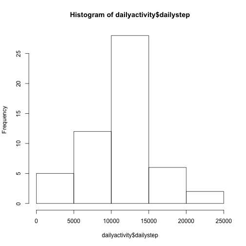
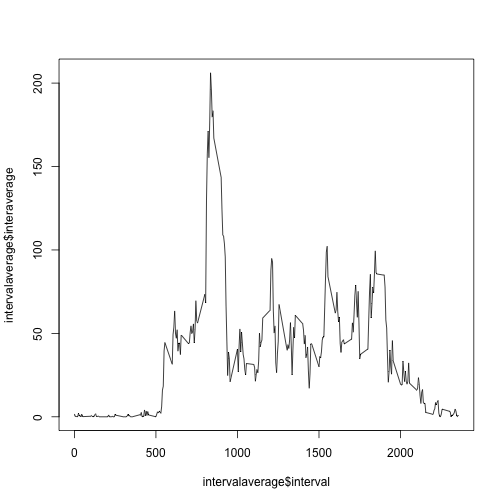
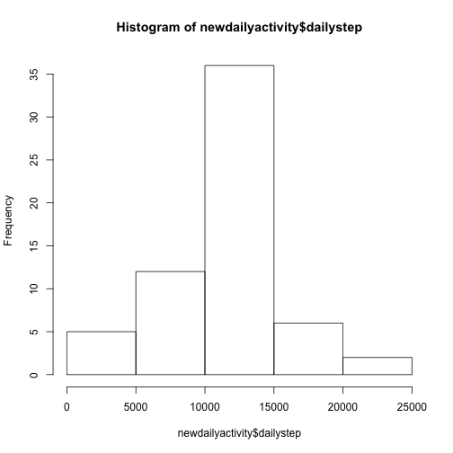
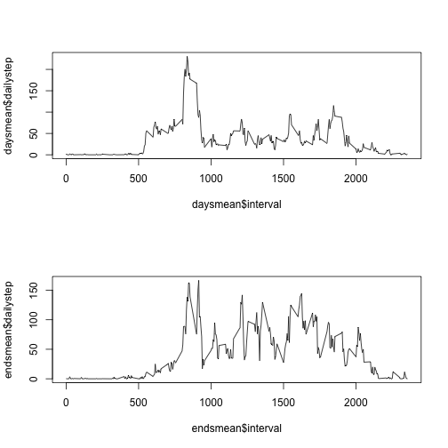

## Loading and preprocessing the data

1.Code for reading in the dataset and/or processing the data

```r
library(dplyr)
activity<-read.csv("activity.csv")
```

# What is mean total number of steps taken per day?

2.Histogram of the total number of steps taken each day

3.Mean andmedian number of steps taken each day

```r
dailyactivity<-activity%>% group_by(date) %>% summarize(dailystep=sum(steps))
hist(dailyactivity$dailystep)
```



```r
meandaily<-mean(dailyactivity$dailystep,na.rm=TRUE)
meandaily
```

```
## [1] 10766.19
```

```r
mediandaily<-median(dailyactivity$dailystep,na.rm=TRUE)
mediandaily
```

```
## [1] 10765
```

# What is the average daily activity pattern?
4.Time series plot of the average number of steps taken

5.The 5-minute interval that, on average, contains the maximum number of steps

```r
intervalaverage<-activity%>% group_by(interval) %>% summarize(interaverage=mean(steps,na.rm=TRUE))
plot(x=intervalaverage$interval,y=intervalaverage$interaverage,type="l")
```



```r
maxinterval<-intervalaverage$interval[which.max(intervalaverage$interaverage)]
maxinterval
```

```
## [1] 835
```

## Imputing missing values

6.Calculate and report the total number of missing values in the dataset (i.e. the total number of rows with \color{red}{\verb|NA|}NAs)

```r
nacount<-sum(is.na(activity$steps))
nacount
```

```
## [1] 2304
```

6.2 Devise a strategy for filling in all of the missing values in the dataset

6.3 Create a new dataset that is equal to the original dataset but with the missing data filled in.

```r
al<-length(activity$interval)
newsteps<-activity$steps
for (i in 1:al){
  if (is.na(activity[i,1])){
    timeloc<-which(intervalaverage$interval==activity[i,3])
    newsteps[i]<-intervalaverage$interaverage[timeloc]
  }
}
```

7.total number of steps taken each day after missing values are imputed

```r
newactivity<-activity
newactivity$steps<-newsteps
newdailyactivity<-newactivity%>% group_by(date) %>% summarize(dailystep=sum(steps))

newmeandaily<-mean(newdailyactivity$dailystep,na.rm=TRUE)
newmeandaily
```

```
## [1] 10766.19
```

```r
newmediandaily<-median(newdailyactivity$dailystep,na.rm=TRUE)
newmediandaily
```

```
## [1] 10766.19
```

```r
hist(newdailyactivity$dailystep)
```



## Are there differences in activity patterns between weekdays and weekends?
8.Panel plot comparing the average number of steps taken per 5-minute interval across weekdays and weekends

```r
newactivity$date<-as.Date(newactivity$date)
week<-weekdays(newactivity$date)
week2<-weekdays(newactivity$date)
for (i in 1:al) {
    if (week[i]=="Sunday" || week[i]=="Saturday") {week2[i]<-"weekends"}
    else {week2[i]<-"weekdays"}
}
newactivity<-mutate(newactivity,week2)
days<-subset(newactivity,newactivity$week2=="weekdays")
daysmean<-days%>% group_by(interval) %>% summarize(dailystep=mean(steps))
ends<-subset(newactivity,newactivity$week2=="weekends")
endsmean<-ends%>% group_by(interval) %>% summarize(dailystep=mean(steps))

par(mfrow=c(2,1))
plot(daysmean$interval,daysmean$dailystep,type="l")
plot(endsmean$interval,endsmean$dailystep,type="l")
```




